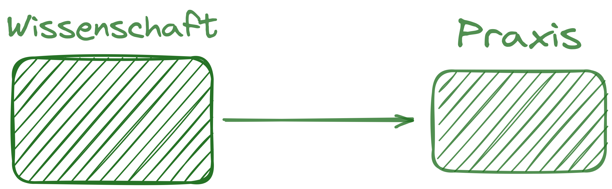
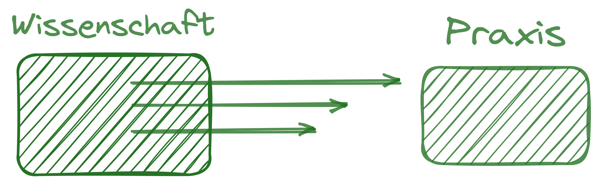
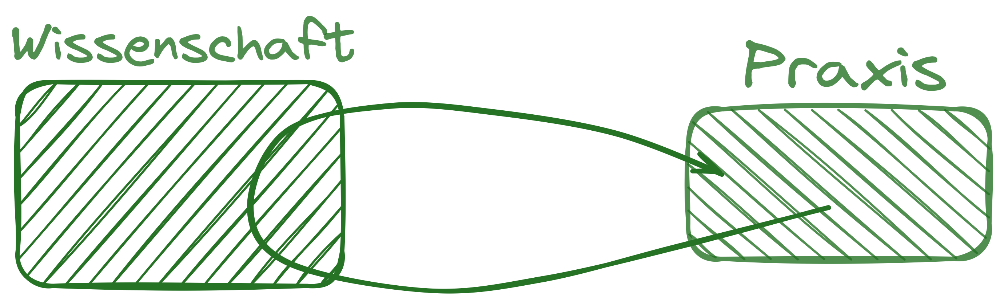
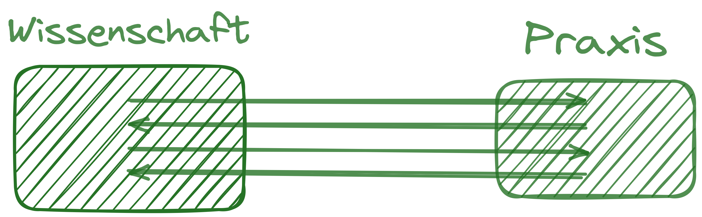
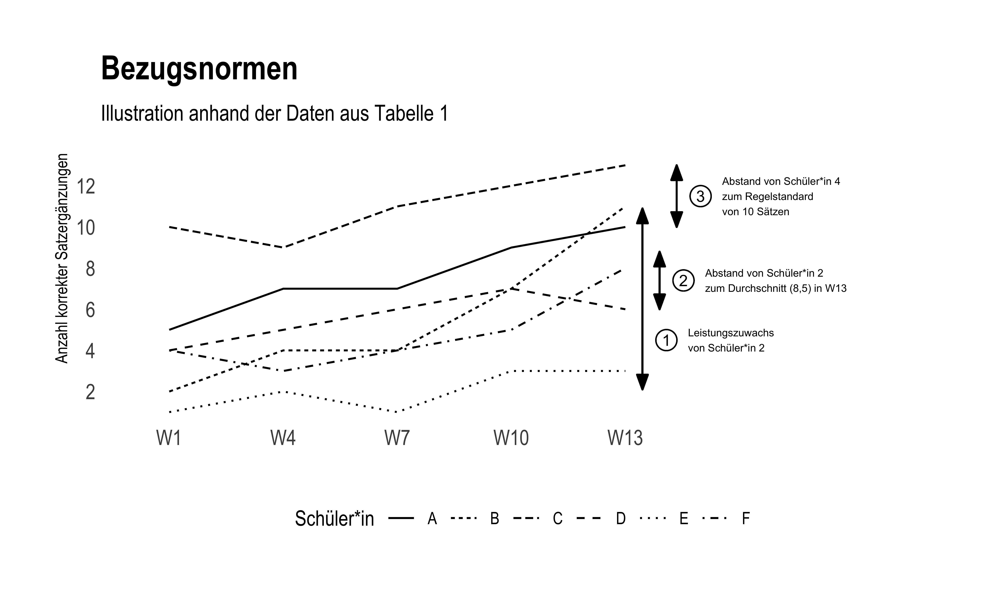

## Überblick {.smaller .center}

```{r }
#| label: libraries
#| echo: false

# z.B. library(tidyverse)
```

|   | Warum Diagnostik?         |
|------------------------------------------:|:--------------------------|
|  | Organisation des Seminars |
|           | Grundbegriffe             |
|         | Übung der Grundbegriffe   |

: {#tbl-agenda tbl-colwidths="\[15,285\]"}

```{=html}
<!-- style the agenda table -->

<style>
#tbl-agenda table th {
font-weight: normal !important;
border: none !important;
}

#tbl-agenda table td {
font-weight: normal !important;
border: none !important;
}
</style>
```
::: footer
 Folien cc-by  unter Kurzlink
:::

# Warum Diagnostik 

##  {.smaller}

::: columns
::: {.column width="34%"}

:::

::: {.column width="66%"}
::: {style="font-size: .8em; line-height: 1em;"}
1)  Wovon wird Lukas gebremst, als er in die Mitte des Sees fahren möchte?
    -   [ ] von einem Blatt
    -   [ ] von einem Loch
    -   [ ] von einem Ast
2)  Was ist Gleichgewicht?
    -   [ ] Wenn zwei Gegenstände das gleiche Gewicht haben, sagt man auch: Sie sind im Gleichgewicht.
    -   [ ] Das Gleichgewicht ist das Gewicht, dass ein Kind bei der Geburt hat.
    -   [ ] Man braucht Gleichgewicht, damit man beim Laufen oder Stehen nicht hinfällt.
3)  Welche Überschrift würde auch zu der Geschichte passen?
    -   [ ] Eine große Verwandlung
    -   [ ] Im Zug
    -   [ ] Risse im Eis
:::
:::
:::

[**🧠-🧑‍🤝‍🧑-💬: Wie würden Sie die Lesekompetenz beschreiben und welche Förderung empfehlen?**]{.fragment}

## Beispiel 1: Lesen

> Kommentar einer Lehrerin: Das wirkt jetzt bisschen ungewöhnlich. Ich glaube sie versteht gut was sie gelesen hat, aber das Lesen an sich ist dafür relativ fehlerhaft und langsam. Der Sichtwortschatz kommt mir auch relativ klein vor. Ich würde dem Kind Lesesprints oder Stolperwörtersätze in die nächsten Wochenpläne schreiben.

## Beispiel 2: Mathematik

::: columns
::: {.column width="40%"}
Ein Kind rechnet:

$$ 53 - 28 = 21$$
:::

::: {.column width="60%"}
[Kommentar einer Lehrerin: "Das ist eine typische Verwechnslung: Das Kind hat wahrscheinlich zuerst 53 - 30 gerechent und dann 2 subtrahiert (weil es ja eine Minusaufgabe ist) statt die 2 zu addieren. Ich rate dann immer zu einem zweiten Rechenweg. Hier vllt. von der 28 zur 30 und von der 30 zur 53.]{.fragment}
:::
:::

## Diagnostik als Teil professioneller Kompetenz

{width="70%" fig-align="center"}

## Funktion von Kompetenz

### Für die Theorie-Praxis-Relationierung

::: columns
::: {.column width="50%"}
{.lightbox width="80%" group="my-gallery" fig-align="left"}

{.lightbox width="80%" group="my-gallery" fig-align="left"}
:::

::: {.column width="50%"}
{.lightbox width="80%" group="my-gallery" fig-align="left"}

{.lightbox width="80%" group="my-gallery" fig-align="left"}
:::
:::

# Organisatorisches 

## Organisatorisches {.smaller}

-   Ring-Seminar Gleser/Lunowa/Merk/Prinz
    -   Sie bleiben im Raum - alle vier Wochen kommt eine neuer Dozent bzw. eine neue Dozentin
-   Jeder Dozent, jede Dozentin definiert eine Teilstudienleistung
-   Seminarmodus:
    -   Ich biete:
        -   Wenig Aufwand zwischen den Sitzungen
        -   Kein Bulimierlernen auf Klausur
    -   Ich erwarte:
        -   Aufmerksamkeit in Sitzungen und zügig-konstruktive Mitarbeit
        -   Kumulative Wissensstruktur erfordert kontinuierliche Arbeit

# Grundbegriffe 

## Grundbegriffe {.smaller}

-   **Diagnostik**: Kleber [-@kleber1992, S. 15] definiert Diagnostik allgemein als die »*methodische Erforschung der Merkmale eines Gegenstandes oder einer Person*«
-   **Pädagogische Diagnostik**: *»\[...\] umfasst alle diagnostischen Tätigkeiten, durch die bei \[...\] Lernenden \[...\] Voraussetzungen und Bedingungen planmäßiger Lehr- und Lernprozesse ermittelt, Lernprozesse analysiert und Lernergebnisse festgestellt werden, um individuelles Lernen zu optimieren*« [@ingenkamp2008, S.13]

> 🧑‍🤝‍🧑: 1) Identifizieren Sie Ihnen bekannte typische Vorgehensweisen in der Schule, die der Definition pädagogischer Diagnostik entsprechen. 2) Suchen Sie Beispiele für Diagnostiken in der Schule, die (eher) keine pädagogische Diagnostiken sind. 3) Gibt es pädagogische Diagnostiken die die Definiton der Diagnostik nach Kleber nicht erfüllen?

## Bezugsnormen {.smaller}

Neben der **Messung** schulischer Fähigkeiten stellt die **Bewertung** selbiger eine zentrale Herausforderung für LuL dar [@bohl2004]. Grundsätzlich wird dabei zwischen **formativem** und **summativem** Assessment unterschieden. Bei ersterem dient die Leistungsmessung der Ermittlung des Unterschieds zwischen Lernstand und Lernziel und der dadurch notwendigen nächsten Lernschritte [@schuetze2018].\
Bei der summativen Leistungsbewertung wird typischerweise zwischen drei Bezugsnormen unterschieden:\
{.lightbox width="30%"}

## Bezugsnormen {.smaller}

Unter Bezugsnormen versteht man den ‚Standard‘, der zur Bewertung einer Leistung herangezogen wird [@heckhausen1974].

-   Die **»soziale Bezugsnorm«** liegt vor, wenn das zu bewertende Ergebnis mit den Ergebnissen einer Vergleichsgruppe, die denselben Test durchlaufen hat, abgeglichen wird.\
-   Die **»kriteriale Bezugnorm«** (auch ‚sachliche Bezugnorm‘; Rheinberg & Fries, @rheinberg2010a) legt a priori inhaltlich fest, was eine ‚gute‘ Leistung auszeichnet.\
-   Die **»individuelle Bezugsnorm«** (auch ‚temporale‘, ‚intraindividuelle‘ oder ‚ipsative Bezugsnorm‘) vergleicht (wie die soziale Bezugsnorm) zur Bewertung einer Leistung diese ebenfalls mit anderen realen (empirisch gemessenen) Leistungen. Allerdings stammen jene Leistungen vom selben Merkmalsträger (Individuum).

## Bezugsnormen
- Die Notenvergabeverordnung Baden-Württemberg impliziert klar die Anwendung der kriterialen Bezugsnorm unter Berücksichtigung der individuellen Bezugsnorm in speziellen Fällen (z.B. Probeversetzung).
- Die Anwendung der individuellen Bezugsnorm gilt jedoch als stärker motivations- und lernförderlich [@rheinberg2010a]
- Lehrerinnen und Lehrer wenden in der Praxis wohl meist implizit eine Mischung von Bezugsnormen an. Dies senkt die Konstruktvalidität der Leistungsmessung [@merk2023b].

## Übung Bezugsnormen
> Bearbeiten Sie die Aufgaben "Bezugnormen in Aussagen erkennen" unter [https://sammerk.github.io/aufgaben-book/messtheorie.html](https://sammerk.github.io/aufgaben-book/messtheorie.html)

## References {.scrollable}
