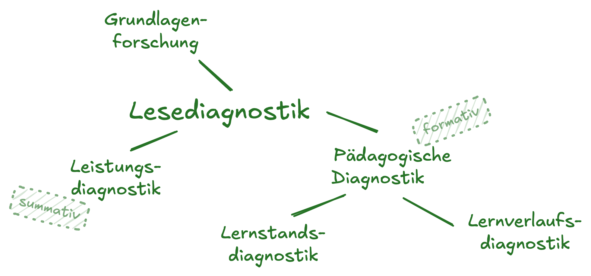
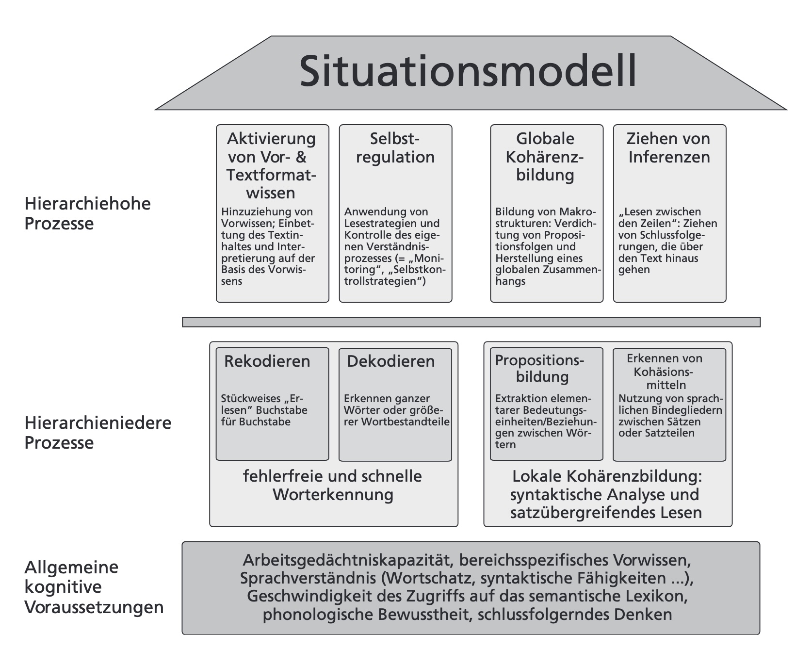
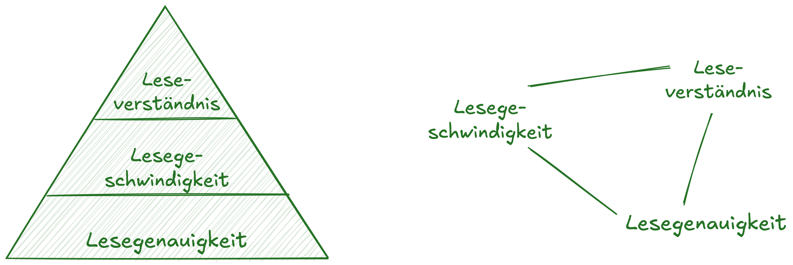

## Überblick {.smaller .center}

```{r }
#| label: libraries
#| echo: false

# z.B. library(tidyverse)
```

|   | Vorwissen aktivieren         |
|------------------------------------------:|:--------------------------|
|  | Wozu Lesediagnostik? |
|  | Lesediagnostik (ELFE) selbst durchführen |
|  | Lesekompetenzmodelle   |
|  | Exkurs: »Praktische Theorie«   |
|  | Lesekompetenztests   |

: {#tbl-agenda tbl-colwidths="\[15,285\]"}

```{=html}
<!-- style the agenda table -->

<style>
#tbl-agenda table th {
font-weight: normal !important;
border: none !important;
}

#tbl-agenda table td {
font-weight: normal !important;
border: none !important;
}
</style>
```
::: footer
 Folien cc-by  unter Kurzlink
:::

# Vorwissen aktivieren   

## Vorwissen aktivieren
Diskutieren Sie mit der Sitznachbarin:

* Woran würden Sie als Lehrkraft eine gute Leser:in erkennen?
* Wie kann Lesekompetenz objektiv, reliabel und konstruktvalide erfasst werden? 
    * Wie würden Sie diese Lesekompetenz quantifizieren?
    
# Wozu Lesediagnostik   

## Wozu Lesediagnostik? (Aufgabe) {.smaller}
:::: {.columns}
::: {.column width='60%'}
{.lightbox width=40% fig-align="center"}
:::

::: {.column width='40%'}
Nach [@gebhardt2021] können folgende Formen der Diagnostik unterschieden werden:
:::

::::

Ordnen Sie die folgenden Anliegen einer geeigneten Form von Diagnostik zu:

* »Ich möchte evaluieren ob meine regelmäßigen Blitzleseübungen den schwachen Leser:innen helfen« 
* »Ich möchte jeweils starke und schwache Leser:innen zu Lesesporttandems (Trainer:in-Sportler:in) gruppieren« 
* »Ich möchte wissen, ob ob das Lesekompetenzmodell von Rosebrock & Nix sich in der Realität wiederfindet«
* »Ich möchte die Leseleistung meiner Schüler:innen fair - also objektiv, reliabel und konstruktvalide - benoten«

## Wozu Lesediagnostik? (Lösung) {.smaller}
:::: {.columns}
::: {.column width='60%'}
{.lightbox width=40% fig-align="center"}
:::

::: {.column width='40%'}
Nach [@gebhardt2021] können folgende Formen der Diagnostik unterschieden werden:
:::

::::

Ordnen Sie die folgenden Anliegen einer geeigneten Form von Diagnostik zu:

* »Ich möchte evaluieren ob meine regelmäßigen Blitzleseübungen den schwachen Leser:innen helfen« **➡️ Verlaufsdiagnostik**
* »Ich möchte jeweils starke und schwache Leser:innen zu Lesesporttandems (Trainer:in-Sportler:in) gruppieren« **➡️ Lernstandsdiagnostik**
* »Ich möchte wissen, ob ob das Lesekompetenzmodell von Rosebrock & Nix sich in der Realität wiederfindet« **➡️ Grundlagenforschung**
* »Ich möchte die Leseleistung meiner Schüler:innen fair - also objektiv, reliabel und konstruktvalide - benoten« **➡️ Leistungsdiagnostik**

# Lesediagnostik (ELFE) selbst durchführen   
## ELFE kennenlernen {.centerk}
> Bitte bearbeiten Sie (digital oder analog) die ausgeteilten Testhefte.

## Das Modell hinter dem ELFE
@lenhard2019 gehen für die Konstruktion des ELFE von foglendem Prozessmodell des Leseverstehens aus:
{.lightbox fig-width="60%"}

# Exkurs: Praktische Theorie   
## »Praktische« Theorie {.smaller .scrollable}

{.lightbox width="35%" fig-align="center"}

. . .

Überlegungen wie obige zur Struktur von Lesekompetenz, werden von Studierenden oft als »theoretisch« wahrgenommen [@vogel2022]. Dies ist insofern zutreffend, als dass Entitäten wie »Lesegenauigkeit« oder »Leseverständnis« nicht real existieren oder zumindest nicht manifest sind. Dennoch lässt sich argumentieren, dass solch »theoretisches Wissen« sehr »praktisch« im Sinne von »heuristisch« (bildungssprachl. *zur Problemlösung anleitend*) ist: Nimmt Lehrkraft A (implizit oder explizit) die links abgebildete, hierarchische Kompetenzstruktur an, wird sie anders auf ein Kind mit mangelndem Lese**verständnis** reagieren als eine Lehrkraft die die rechts abgebildete Netzwerkstruktur annimmt:  
Lehrkraft A wird vermutlich zunächst prüfen ob das mangelnde Lese**verständnis** auf mangelnde Lese**geschwindigkeit** und/oder -**genauigkeit** zurückführen ist, um dann die hierarchieniedrigste fehlende Fähigkeit zu fördern, während Lehrkraft B ja die Komponenten als unabhängig betrachtet und deshalb direkt das Leseverständnis zu fördern versucht. Dies ist aber zum Scheitern verurteilt, wenn die Komponenten tatsächlich hierarchisch sind und Lesegeschwindigkeit und/oder -genauigkeit nicht hinreichend ausgeprägt sind.  

## References {.scrollable}
