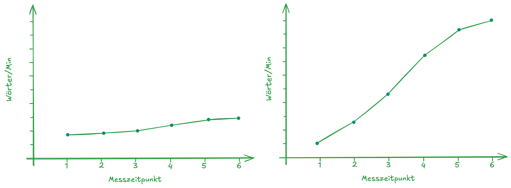
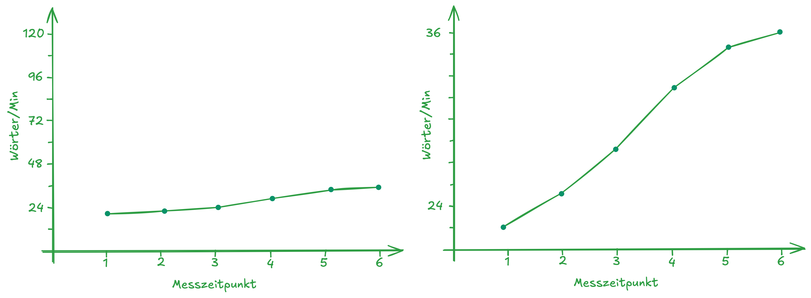
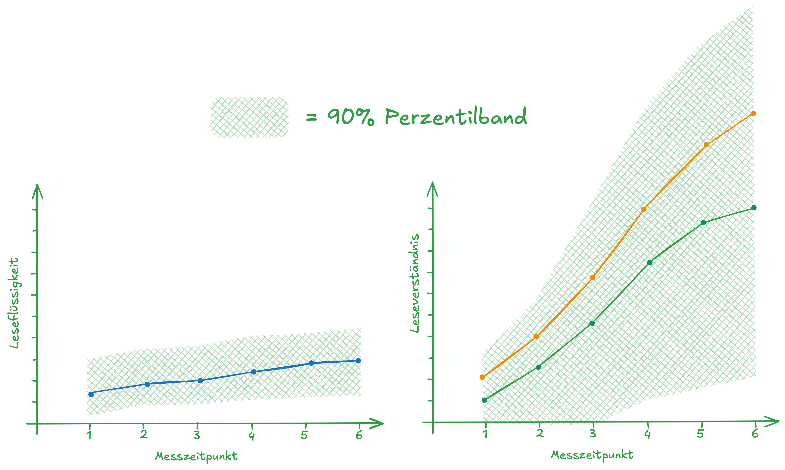
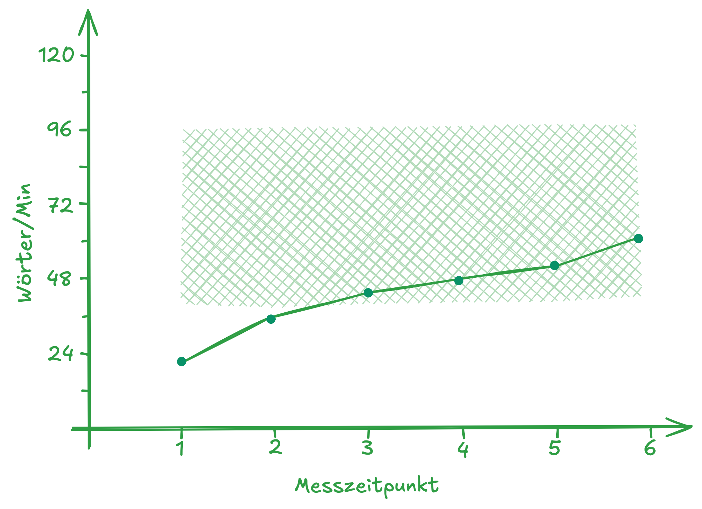
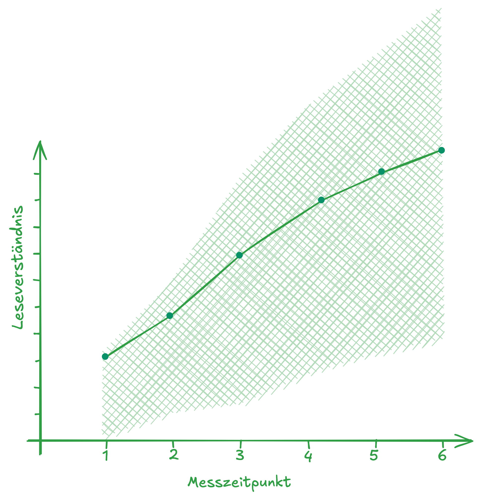

## Überblick {.smaller .center}

```{r }
#| label: libraries
#| echo: false

# z.B. library(tidyverse)
```

|  | Organisatorisches |          
|-----------------:|:-----------------------------------------------------|
|  | Wiederholung (Active Retrieval Practice) |
|  | Lernverläufe interpretieren |
|  | Perzentilbänder interpretieren |

: {#tbl-agenda tbl-colwidths="\[15,285\]"}

```{=html}
<!-- style the agenda table -->

<style>
#tbl-agenda table th {
font-weight: normal !important;
border: none !important;
}

#tbl-agenda table td {
font-weight: normal !important;
border: none !important;
}

#tbl-agenda .quarto-float-caption {
  display: none !important;  
</style>
```


## Organisatorisches  {.smaller}

* Studienleistung: Beispiel wird heute am Ende der Sitzung gegeben 
* Modulleistung: 
    * Seminarweite Einigung: ca. 10 Seiten
    * Themen bei mir:
        * Vergleich von Lernverlaufsdiagnostiksystemen (quop, Lernlinie, Levuumi, CoFormat, etc.)
        * Systematische Review zur Wirksamkeit von Lernverlaufsdiagnostik, Formativem Assessment etc.
        * Herzensthemen 💓 rund um den Themenbereich Assessment (Paradoxe Effekte von Lob und Tadel, Bezugsnormen und Motivation, Ziffernnoten, Noteninflation, etc.)
        
## Lernverläufe interpretieren {.center .smaller}
> **Wie würden Sie diese beiden fiktiven Lernverläufe (Leseflüssigkeit) interpretieren?**  
Think-Pair-Share 🧠-🧑‍🤝‍🧑-💬 mit dem:der Sitznachbar:in

{}

## Lernverläufe interpretieren {.center .smaller}
> **Wie würden Sie diese beiden fiktiven Lernverläufe (Leseflüssigkeit) interpretieren?**  
Think-Pair-Share 🧠-🧑‍🤝‍🧑-💬 mit dem:der Sitznachbar:in

{}

## Lernverläufe interpretieren {.smaller}
> Um einen Lernverlauf als »stagnierend«, »schwach sinkend«, »stark steigend« etc. **bewerten** zu können ist ein Bezugsrahmen/Bezugspunkt notwendig

* Zunächst ist es bei kardinalskalierten Variablen [intervallskalierte Variablen mit »natürlichem Nullpunkt«, @mittag2017] naheliegend, die 0 (0 richtig gelesene Wörter, 0 richtig beantwortete Fragen als Referenzpunkt zu wählen.
* Die Interpretierbarkeit von Unterschieden (z.B. 5 richtig gelesene Wörter mehr) macht dann aber eine konstante Aufgabenschwierigkeit notwendig.
* Ein weiterer beliebter Bezugsrahmen sind sogenannte Perzentilbänder [@kohler2015].
    * Sie beschreiben den Bereich der inneren X% einer Variable (z.B. das »Mittelfeld«, wenn X = 50)
    * So kann ein individueller Verlauf (individuelle Bezugsnorm) mit dem typischen Verlauf verglichen werden (soziale Bezugsnorm)


## Lernverläufe interpretieren {.smaller}
Mit Perzentilbändern können **Verläufe**

:::: {.columns}

::: {.column width='50%'}
1) *[unabhängig von]{style="color:#099268"} [der absoluten Ausprägung]{style="color:#f08c00"}* als »über-/unterdurchschnittlich« identifiziert werden
:::

::: {.column width='50%'}
2) *[unabhängig von]{style="color:#1971c2"} [der Skala]{style="color:#099268"}* absolut und in ihrer Entwicklung verglichen werden
:::

::::


<center>{.lightbox width=60%} </center>
   


## Skizzieren Sie ... {.smaller}

:::: {.columns}

::: {.column width='50%'}
... ein Perzentilband für die Diagnostik der Leseflüssigkeit mit konstanter Breite, das nicht steigt und einen überdurchschnittlichen Lernverlauf einer Schülerin die eine unterdurchschnittliche Ausgangssituation aufweist.
:::

::: {.column width='50%'}
... ein Perzentilband für die Diagnostik der Leseflüssigkeit mit zunehemender Breite, das deutlich steigt einen unterdurchschnittlichen Lernverlauf einer Schülerin die eine überdurchschnittliche Ausgangs- und Endsituation aufweist.
:::

::::

## Skizzieren Sie ... {.smaller}

:::: {.columns}

::: {.column width='50%'}
... ein Perzentilband für die Diagnostik der Leseflüssigkeit mit konstanter Breite, das nicht steigt und einen überdurchschnittlichen Lernverlauf einer Schülerin die eine unterdurchschnittliche Ausgangssituation aufweist.

<center>{.lightbox width=60%} </center>
:::

::: {.column width='50%'}
... ein Perzentilband für die Diagnostik der Leseflüssigkeit mit zunehemender Breite, das deutlich steigt einen unterdurchschnittlichen Lernverlauf einer Schülerin die eine überdurchschnittliche Ausgangs- und Endsituation aufweist.

<center>{.lightbox width=60%} </center>
:::

::::


## Studienleistung
Der Arbeitsauftrag für eine Studienleistung könnte wie folgt aussehen:

> Sie führen seit einem Schuljahr mit Ihrer zweiten Klasse Lernverlaufsdiagnostik zur Lesegenauigkeit, Leseflüssigkeit und zum Leseverständnis durch. Die Folgenden Abbildungen zeigen die längsschnittlichen Ergebniss der Klasse. **Beschreiben** und **bewerten** Sie die Ergebnisse und machen Sie evidenzbasierte Vorschläge zur differenzierten Leseförderung.


## References {.scrollable}


