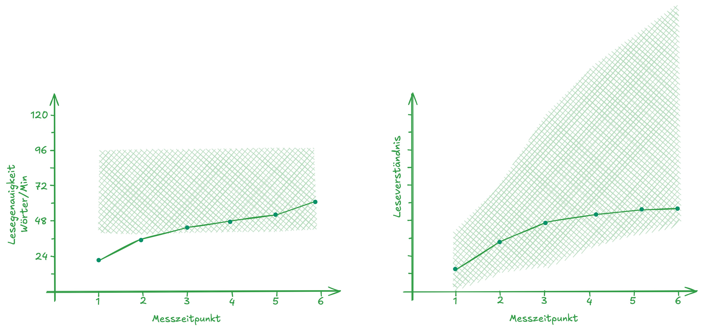
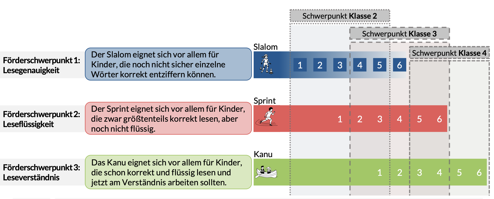
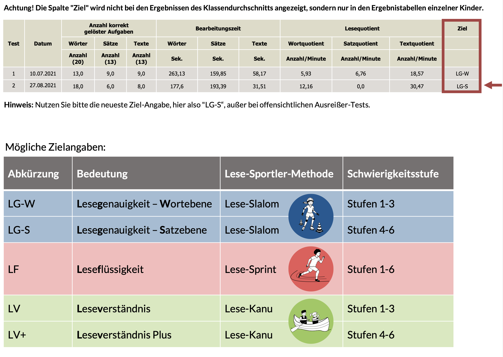

## Überblick {.smaller .center}

```{r }
#| label: libraries
#| echo: false

# z.B. library(tidyverse)
```

|  | Organisatorisches |          
|-----------------:|:-----------------------------------------------------|
|  | Wiederholung (Active Retrieval Practice) |
|  | Gruppenpuzzle: Lesesportler |
|  | Schnellevaluation |

: {#tbl-agenda tbl-colwidths="\[15,285\]"}

```{=html}
<!-- style the agenda table -->

<style>
#tbl-agenda table th {
font-weight: normal !important;
border: none !important;
}

#tbl-agenda table td {
font-weight: normal !important;
border: none !important;
}

#tbl-agenda .quarto-float-caption {
  display: none !important;  
</style>
```


## Organisatorisches  {.smaller}

* Studienleistung: *Sie führen seit einem Schuljahr mit Ihrer zweiten Klasse Lernverlaufsdiagnostik zur Lesegenauigkeit, Leseflüssigkeit und zum Leseverständnis durch. Die Folgenden Abbildungen zeigen die längsschnittlichen Ergebniss der Klasse. **Beschreiben** und **bewerten** Sie die Ergebnisse und machen Sie evidenzbasierte Vorschläge zur differenzierten Leseförderung.*
* Modulleistung (Hausarbeit ca. 10 Seiten)
    * Vergleich von Lernverlaufsdiagnostiksystemen (quop, Lernlinie, Levuumi, CoFormat, etc.)
    * Systematische Review zur Wirksamkeit von Lernverlaufsdiagnostik, Formativem Assessment etc.
    * Herzensthemen 💓 rund um den Themenbereich Assessment (Paradoxe Effekte von Lob und Tadel, Bezugsnormen und Motivation, Ziffernnoten, Noteninflation, etc.)
        
> Wieviele wollen denn die Studienleistung machen?
Aufgabenstellung kommt im Laufe der Woche.


## Wdh. Leselernverläufe interpretieren {.center .smaller}
> **Wie würden Sie diesen Leselernverläufe interpretieren? Welche Leseteilkompetenz sollte gezielt gefördert werden?**  

Lerntempoduett 🐌🐌/🚀🚀: Notieren Sie Ihre Interpretation und Ihren Fördervorschlag auf dem ausgeteilten Zettel und kommen Sie damit nach vorne, sobald Sie fertig sind. Tauschen Sie sich dann mit dem als nächstes nach vorne kommenden dazu aus. 

::: {style="text-align:center;"}
{width=40%}
:::

## Diagnosegeleitete Leseförderung mit den Lesesportlern {.smaller}

##### Ohne proprietäre Lesediagnostik quop
{width=20% fig-align="left"}


##### Mit proprietärer Lesediagnostik quop
{width=20% fig-align="left"}

## Gruppenpuzzle: Lesesportler {.smaller}
#### Expert:innenphase (zu Dritt, 20 Minuten)
* Sichten Sie das Onlinematerial zu Ihrem Lesesport (Slalom 🛼/Sprint 🏃🏻‍♀️/Kanu 🛶)
* Klären Sie offene Fragen dazu mit den Kommiliton:innen/dem Dozenten
* Bereiten Sie sich darauf vor, 
    * mit Ihrer Stammgruppe zunächst Ihre Leseportart zu trainieren und
    * Ihrer Stammgruppe dann auf einer Metaebene die Besonderheiten Ihres Lesesports zu erklären
    
#### Stammgruppenphase (20 Minuten)
* Jede:r Expert:in trainiert die Stammgruppe in seiner:ihrer Leseportart
* Jede:r Expert:in erklärt der Stammgruppe auf einer Metaebene die Besonderheiten Ihres Lesesports


## Schnellevaluation {.smaller}
::: {.incremental}

- Hatten Sie den Eindruck, dass die drei Sitzungen gut aufeinander aufgebaut haben/gut zusammenhingen?
- Kam Ihnen die Gruppenpuzzle-Methode entgegen?
- Lohnt es sich, kleine Wiederholungsmethoden wie den Tandembogen oder das Lerntempoduett einzubauen?
- Wie langweilig waren die Sitzungen?
- Wie komplex war der Inhalt?
- Wie gut konnten Sie sich auf die Inhalte einlassen?
- 🖐🏼

:::

## References {.scrollable}


